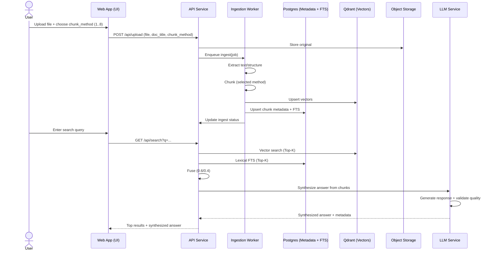

# Backend Architecture — Chatbot with RAG (MVP)

> Draft v0.1 • Winston (Architect)

---

## 1) Context & Goals (MVP)

- **Purpose:** Implement a lean backend that ingests user‑uploaded documents, chunks them using a **fixed method list**, embeds chunks, stores vectors for **hybrid retrieval (semantic + lexical)** with cosine similarity, and **synthesizes answers** using integrated LLM capabilities.
- **Scope (backend only):** File intake API, preprocessing & chunking, embeddings, vector storage (**Qdrant**), **lexical index**, hybrid query service, **LLM integration service**, answer synthesis pipeline, simple auth integration, structured logs.
- **Non‑goals (MVP):** Arabic/RTL, RBAC/SSO, multi‑tenant controls, OCR for scanned PDFs, advanced security hardening, dashboards, **evaluation harness**, **dead‑letter queues**, **explicit caching layers**.

**Success at GA (backend):**

- End‑to‑end pipeline operational: _Upload → Extract → Chunk → Embed → Qdrant + Lexical → Hybrid Query → LLM Synthesis → Answer Response_.
- Meets baseline **quality** (sanity checks) and acceptable **latency** on seed pack (informal).
- **Answer synthesis** operational with configurable LLM providers and quality validation.
- Basic retry & error surfacing; method & status visible to UI.

---

## 2) Constraints & Assumptions

- **File types:** PDF, DOCX, TXT, MD. **Max 20 MB**. **No OCR** (scanned PDFs blocked/flagged).
- **Language:** English‑only for MVP.
- **Chunking methods (fixed, selectable at upload):** **1, 2, 3, 4, 5, 6, 7, 8.**
- **Embedding provider/model:** **TBD via env**; dimensions & tokenizer standardized and pinned.
- **LLM provider/model:** **Groq** (primary), configurable via env (OpenAI, Anthropic, local models); API keys and parameters configurable.
- **Retrieval defaults:** semantic top‑k=20; lexical top‑k=20; fused return=10; **weights 0.6/0.4** (semantic/lexical).
- **Answer synthesis:** **p95 ≤ 3s** latency; quality validation with fallback to raw results.
- **Persistence:** **Qdrant** for vectors; **Relational DB** (proposed: Postgres) for metadata & lexical FTS; object storage for originals.
- **Auth:** Email/password via web app; backend validates session/JWT; HTTPS required.
- **Deployment:** SaaS, **single‑tenant** per deployment; light concurrency (single‑digit users).
- **Observability:** Structured logs only (console + file). No metrics, no dashboards.

---

## 3) High‑Level Design (Snapshot)

### 3.1 Services (MVP minimalism)

- **Gateway/API Service**\
  REST endpoints: upload, ingestion status, search. Performs lightweight validation and enqueues ingest jobs.
- **Ingestion Worker**\
  Extracts text → applies chosen chunker → generates embeddings → writes: chunks + vectors to Qdrant; metadata to DB; updates lexical index.
- **Query/Hybrid Service**\
  Accepts a query → (optional) embed → run vector search (Qdrant) + lexical FTS → **fuse** by fixed weights → return top results with source metadata.
- **LLM Integration Service (Groq)**\
  Groq-optimized LLM provider → answer synthesis from retrieved chunks → quality validation → response formatting with fallback handling.

### 3.2 Storage

- **Object storage** (original files)
- **Relational DB (Postgres)**: documents, chunk metadata `{doc_id, chunk_id, method, hash, source, page/section}`, ingest statuses; **FTS** index (tsvector) per corpus for BM25‑like ranking.
- **Qdrant**: collection per tenant; vector payload mirrors metadata keys for filtering.

#### 3.2.1 Postgres FTS — Primer (for context)

**Postgres Full‑Text Search (FTS)** indexes text into a `tsvector` and queries with a `tsquery`. With a **GIN** (or GiST) index on the `tsvector` column, Postgres can quickly match keywords and rank results (e.g., via `ts_rank`). We use FTS as the **lexical** side of **hybrid search**, complementing Qdrant’s semantic similarity.

### 3.3 Data Flow

1. **Upload** → validate size/type → persist original → enqueue **ingest(job)**.
2. **Ingest(job)** → extract text/structure → **chunk (selected method)** → embed → write **Qdrant vectors** + **DB metadata/FTS** → mark status.
3. **Search** → (optional) embed query → **vector K=20** + **lexical K=20** → **fuse (0.6/0.4)** → **LLM synthesis** → return **top 10** with attributions + **synthesized answer**.

#### 3.3.1 Sequence (added)



### 3.4 Reliability & Ops

- **Retries:** single automatic retry for transient errors; otherwise fail fast with clear status.
- **LLM fallback:** graceful degradation to raw results if LLM service fails or quality validation fails.
- **Operational simplicity:** no DLQ; failures visible via status endpoint and logs.
- **Performance guardrails:** cap per‑request K; batch embeddings where convenient; **LLM response caching** for repeated queries. No dedicated cache layer.

### 3.5 Security (MVP)

- **Development/testing only** posture. No RBAC/SSO.
- Backend trusts the web app's session/JWT when present; for local dev, allow a simple header token switch.
- Secrets via environment variables (.env); **LLM API keys** stored securely. **Non‑local environments MUST enforce HTTPS**; local dev may disable for convenience.

---

## 4) API (Draft) — trimmed for MVP

- `POST /api/upload` — multipart; params: `chunk_method` (enum), `doc_title`.
- `GET /api/ingestions/{id}` — status + counts.
- `GET /api/search?q=...` — hybrid query; returns ranked results with `{doc, chunk_id, method, snippet, score, page/section}` + **synthesized answer**.
- `GET /api/search?q=...&include_answer=true` — optional answer generation parameter.

---

## 5) Decisions (MVP) & Minimal Open Questions

**Pinned for MVP:**

- **Lexical index:** Postgres FTS in the primary DB.
- **Vector DB:** Qdrant, single collection (single‑tenant deployment).
- **Fusion:** semantic K=20, lexical K=20, fused return=10, weights 0.6/0.4.
- **Upload policy:** PDF/DOCX/TXT/MD, max 20 MB. Scanned PDFs blocked/flagged; no OCR.

**Minimal Open Questions:**

1. **Embedding model default** — propose `e3‑small`‑class, 1536‑dim; override via env if needed.
2. **Auth handoff** — confirm whether backend should require a signed session/JWT in MVP or accept a dev header token only.
3. **Chunk metadata** — any extra fields needed beyond `{doc_id, chunk_id, method, hash, source, page/section}` for your UI? (e.g., section titles).

---

## 6) Health & Readiness Checks

Define two lightweight endpoints:

- `GET /healthz` — **Liveness**: returns `200` if the process is up and can accept connections.
- `GET /readyz` — **Readiness**: verifies dependencies and returns component statuses: Qdrant (collection ping), Postgres (`SELECT 1`), Embedding provider (no‑op or cached warmup), **LLM service** (health check or no‑op).

**Response shape (example):**

```json
{
  "status": "ready",
  "components": {
    "qdrant": "ok",
    "postgres": "ok",
    "embeddings": "ok",
    "llm": "ok"
  },
  "checked_at": "2025-09-29T00:00:00Z"
}
```

---

## 7) Error Model (JSON)

All error responses follow a single envelope so the frontend can handle uniformly.

```json
{
  "error": {
    "code": "INGEST_FAILED",
    "message": "Embedding provider timed out",
    "details": { "doc_id": "abc123" },
    "requestId": "req_01HF…"
  }
}
```

HTTP status codes: 400, 401/403, 404, 409, 429, 500/502/504.

---

## 8) Configuration (Environment Variables)

| Key                           | Purpose                          | Example / Default    |
| ----------------------------- | -------------------------------- | -------------------- |
| `EMBEDDING_PROVIDER`          | which provider to call           | `openai`             |
| `EMBEDDING_MODEL`             | model id (dim must match Qdrant) | `e3-small`           |
| `EMBED_DIM`                   | vector dimension                 | `1536`               |
| `QDRANT_URL`                  | Qdrant endpoint                  | `http://qdrant:6333` |
| `QDRANT_COLLECTION`           | collection name                  | `corpus_default`     |
| `DATABASE_URL`                | Postgres connection string       | `postgres://…`       |
| `TOPK_VEC`                    | vector top-K                     | `20`                 |
| `TOPK_LEX`                    | lexical top-K                    | `20`                 |
| `FUSE_SEM_WEIGHT`             | semantic weight                  | `0.6`                |
| `FUSE_LEX_WEIGHT`             | lexical weight                   | `0.4`                |
| `MAX_UPLOAD_MB`               | upload size cap                  | `20`                 |
| `JWT_ISSUER` / `JWT_AUDIENCE` | token validation (if enabled)    |                      |
| `RATE_LIMIT_QPS`              | per-IP or per-user search rate   | `5`                  |

---

## 9) Data Model

### 9.1 Relational Schema (Postgres)

```sql
CREATE TABLE documents (
  id           TEXT PRIMARY KEY,
  title        TEXT NOT NULL,
  mime         TEXT NOT NULL,
  bytes        INTEGER NOT NULL,
  sha256       TEXT NOT NULL,
  created_at   TIMESTAMPTZ NOT NULL DEFAULT now()
);

CREATE TABLE ingestions (
  id           TEXT PRIMARY KEY,
  doc_id       TEXT NOT NULL REFERENCES documents(id) ON DELETE CASCADE,
  method       INTEGER NOT NULL,
  status       TEXT NOT NULL, -- queued|extracting|chunking|embedding|indexing|done|failed|blocked_scanned_pdf
  error        JSONB,
  started_at   TIMESTAMPTZ,
  finished_at  TIMESTAMPTZ
);

CREATE TABLE chunks (
  id           TEXT PRIMARY KEY,
  doc_id       TEXT NOT NULL REFERENCES documents(id) ON DELETE CASCADE,
  method       INTEGER NOT NULL,
  page_from    INTEGER,
  page_to      INTEGER,
  hash         TEXT NOT NULL,
  text         TEXT NOT NULL,
  created_at   TIMESTAMPTZ NOT NULL DEFAULT now()
);

CREATE TABLE search_logs (
  id           TEXT PRIMARY KEY,
  query        TEXT NOT NULL,
  params_json  JSONB NOT NULL,
  latency_ms   INTEGER NOT NULL,
  created_at   TIMESTAMPTZ NOT NULL DEFAULT now()
);
```

### 9.2 Lexical FTS Configuration

```sql
CREATE EXTENSION IF NOT EXISTS unaccent;
CREATE EXTENSION IF NOT EXISTS pg_trgm;
ALTER TABLE chunks
  ADD COLUMN tsv tsvector GENERATED ALWAYS AS (
    to_tsvector('english', unaccent(text))
  ) STORED;
CREATE INDEX IF NOT EXISTS idx_chunks_tsv ON chunks USING GIN(tsv);
```

### 9.3 Qdrant Collection & Payload

**Collection config (example):**

```json
{
  "vectors": { "size": 1536, "distance": "Cosine" },
  "optimizers_config": { "default_segment_number": 2 }
}
```

**Payload fields:** `doc_id, chunk_id, method, page_from, page_to, hash, source`.

---

## 10) API Contracts (Examples)

### 10.1 `POST /api/upload`

**Request:** multipart `file`, `doc_title`, `chunk_method` ∈ **{1,2,3,4,5,6,7,8}**  
**Response:** `201 Created`

```json
{ "doc_id": "doc_01HFX…", "ingestion_id": "ing_01HFX…" }
```

### 10.2 `GET /api/ingestions/{id}`

**Response:** `200 OK`

```json
{
  "id": "ing_01HFX…",
  "doc_id": "doc_01HFX…",
  "status": "indexing",
  "counts": { "chunks": 128, "vectors": 128 },
  "blocked_reason": null,
  "errors": []
}
```

### 10.3 `GET /api/search?q=...`

**Response:** `200 OK`

```json
{
  "params": {
    "topk_vec": 20,
    "topk_lex": 20,
    "w_sem": 0.6,
    "w_lex": 0.4,
    "include_answer": true
  },
  "latency_ms": 1200,
  "results": [
    {
      "doc_id": "doc_01HFX…",
      "chunk_id": "ch_00045",
      "method": 4,
      "page_from": 2,
      "page_to": 3,
      "snippet": "…",
      "score": 0.82
    }
  ],
  "answer": {
    "text": "Based on the retrieved documents, the answer to your query is...",
    "sources": ["doc_01HFX…"],
    "confidence": 0.85,
    "generated_at": "2025-09-29T00:00:00Z"
  }
}
```

---

## 11) Idempotency & De‑duplication

**Removed for MVP testing.** Re‑ingesting the same file/method may create duplicate chunks and vectors; acceptable during testing.

---

## 12) Performance Targets (Pinned)

- Hybrid search latency: **p95 ≤ 1.5s**, **p99 ≤ 3.0s** on seed corpus.
- **Answer generation latency: p95 ≤ 3.0s** on seed corpus.
- Ingestion throughput: **200–300 pages ≤ 20 min**.
- Upload limit: **20 MB**.

**Notes:**

- **Percentiles explained:** _p95_ means 95% of requests complete within the stated bound; _p99_ covers the tail (rare slow cases).
- **Testing policy:** During MVP **testing**, these targets are **reference‑only** (non‑binding); collect timings but do **not** gate pass/fail on these numbers.

---

## 13) Rate Limiting & Security Notes

- Rate limit `search` and `upload` (`RATE_LIMIT_QPS=5`).
- Validate JWT in non-local; allow dev header token locally.
- Password hashing (bcrypt/argon2) at web-app; backend trusts JWT.
- Secrets via env/manager; never log secrets.

---

## 14) LLM Integration Architecture

### 14.1 Service Design

**LLM Service Layer (Groq):**

- **Primary Provider**: Groq API for fast inference and optimized performance
- **Provider Abstraction**: Configurable interface supporting Groq (primary), OpenAI, Anthropic, and local models
- **Response Validation**: Quality checks and coherence validation before returning answers
- **Fallback Handling**: Graceful degradation to raw search results on LLM failures
- **Caching Strategy**: Intelligent caching of responses for repeated queries

### 14.2 Integration Flow

1. **Query Processing**: User query → Hybrid search → Retrieved chunks
2. **Answer Synthesis**: Chunks + query context → LLM service → Generated answer
3. **Quality Validation**: Answer coherence, relevance, and source attribution validation
4. **Response Formatting**: Combined response with both raw chunks and synthesized answer

### 14.3 Configuration Management

**Environment Variables:**

- `LLM_PROVIDER`: Provider selection (groq/openai/anthropic/local) - **default: groq**
- `LLM_MODEL`: Model identifier (llama3-8b-8192, mixtral-8x7b-32768, gpt-3.5-turbo, etc.)
- `LLM_API_KEY`: API authentication key (Groq API key)
- `LLM_MAX_TOKENS`: Maximum response length (default: 1000)
- `LLM_TEMPERATURE`: Response creativity (0.0-1.0, default: 0.7)

### 14.4 Error Handling

**Failure Modes:**

- **LLM Service Unavailable**: Fallback to raw search results
- **Quality Validation Failed**: Return raw results with warning
- **API Rate Limits**: Implement exponential backoff and retry
- **Invalid Response**: Log error and fallback gracefully

### 14.5 Groq-Specific Configuration

**Groq Advantages:**

- **Ultra-fast inference**: 10-100x faster than traditional cloud providers
- **Cost-effective**: Competitive pricing for high-throughput applications
- **Multiple models**: Support for Llama, Mixtral, and other open-source models
- **Low latency**: Optimized for real-time applications

**Recommended Groq Models:**

- `llama3-8b-8192`: Fast, general-purpose model (recommended for MVP)
- `mixtral-8x7b-32768`: Higher quality, larger context window
- `llama3-70b-8192`: Best quality, larger model

**Groq API Configuration:**

```bash
LLM_PROVIDER=groq
LLM_MODEL=llama3-8b-8192
LLM_API_KEY=gsk_...
LLM_MAX_TOKENS=1000
LLM_TEMPERATURE=0.7
```

### 14.6 Performance Considerations

**Optimization Strategies:**

- **Response Caching**: Cache answers for identical queries
- **Async Processing**: Non-blocking answer generation where possible
- **Token Management**: Efficient prompt engineering to minimize token usage
- **Batch Processing**: Group similar queries for efficiency
- **Groq-specific**: Leverage Groq's fast inference for real-time responses

---

## 15) Scanned-PDF Detection (No OCR in MVP)

If characters/page `< 20` on ≥ 80% of pages, set status `blocked_scanned_pdf` and surface `blocked_reason: "scanned_pdf"` in status API. \*
