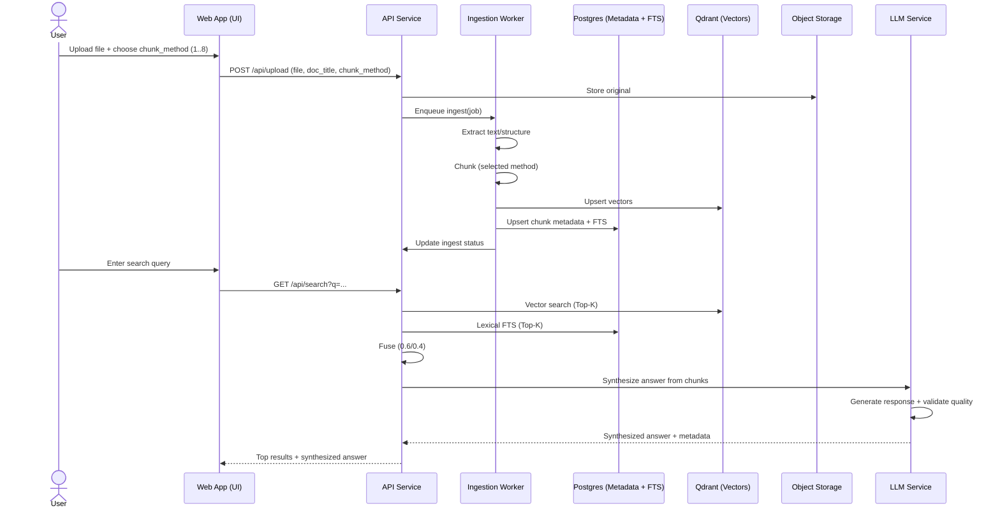

# 3) High‑Level Design (Snapshot)

## 3.1 Services (MVP minimalism)

- **Gateway/API Service**\
  REST endpoints: upload, ingestion status, search. Performs lightweight validation and enqueues ingest jobs.
- **Ingestion Worker**\
  Extracts text → applies chosen chunker → generates embeddings → writes: chunks + vectors to Qdrant; metadata to DB; updates lexical index.
- **Query/Hybrid Service**\
  Accepts a query → (optional) embed → run vector search (Qdrant) + lexical FTS → **fuse** by fixed weights → return top results with source metadata.
- **LLM Integration Service (Groq)**\
  Groq-optimized LLM provider → answer synthesis from retrieved chunks → quality validation → response formatting with fallback handling.

## 3.2 Storage

- **Object storage** (original files)
- **Relational DB (Postgres)**: documents, chunk metadata `{doc_id, chunk_id, method, hash, source, page/section}`, ingest statuses; **FTS** index (tsvector) per corpus for BM25‑like ranking.
- **Qdrant**: collection per tenant; vector payload mirrors metadata keys for filtering.

### 3.2.1 Postgres FTS — Primer (for context)

**Postgres Full‑Text Search (FTS)** indexes text into a `tsvector` and queries with a `tsquery`. With a **GIN** (or GiST) index on the `tsvector` column, Postgres can quickly match keywords and rank results (e.g., via `ts_rank`). We use FTS as the **lexical** side of **hybrid search**, complementing Qdrant’s semantic similarity.

## 3.3 Data Flow

1. **Upload** → validate size/type → persist original → enqueue **ingest(job)**.
2. **Ingest(job)** → extract text/structure → **chunk (selected method)** → embed → write **Qdrant vectors** + **DB metadata/FTS** → mark status.
3. **Search** → (optional) embed query → **vector K=20** + **lexical K=20** → **fuse (0.6/0.4)** → **LLM synthesis** → return **top 10** with attributions + **synthesized answer**.

### 3.3.1 Sequence (added)

## 3.4 Reliability & Ops

- **Retries:** single automatic retry for transient errors; otherwise fail fast with clear status.
- **LLM fallback:** graceful degradation to raw results if LLM service fails or quality validation fails.
- **Operational simplicity:** no DLQ; failures visible via status endpoint and logs.
- **Performance guardrails:** cap per‑request K; batch embeddings where convenient; **LLM response caching** for repeated queries. No dedicated cache layer.

## 3.5 Security (MVP)

- **Development/testing only** posture. No RBAC/SSO.
- Backend trusts the web app's session/JWT when present; for local dev, allow a simple header token switch.
- Secrets via environment variables (.env); **LLM API keys** stored securely. **Non‑local environments MUST enforce HTTPS**; local dev may disable for convenience.

---
