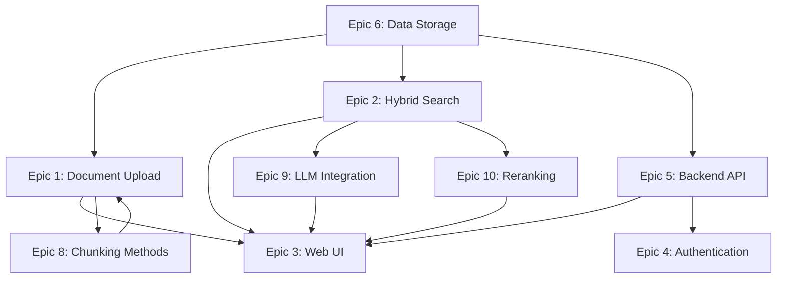

# Epics Overview

This directory contains the epic definitions extracted from the PRD and architecture documents for the Chatbot with RAG MVP project.

## Epic List

1. **[Epic 1: Document Upload & Ingestion Pipeline](./epic-1-document-upload-ingestion.md)**

   - Core document processing and ingestion functionality
   - Priority: High
   - Effort: Large (8-13 story points)

2. **[Epic 2: Hybrid Search & Retrieval System](./epic-2-hybrid-search-retrieval.md)**

   - Semantic and lexical search capabilities
   - Priority: High
   - Effort: Large (8-13 story points)

3. **[Epic 3: Web User Interface](./epic-3-web-ui-interface.md)**

   - User-facing web interface
   - Priority: High
   - Effort: Medium (5-8 story points)

4. **[Epic 4: Authentication & Authorization](./epic-4-authentication-authorization.md)**

   - Basic email/password authentication
   - Priority: Medium
   - Effort: Medium (5-8 story points)

5. **[Epic 5: Backend API & Services](./epic-5-api-backend-services.md)**

   - Core backend services and API endpoints
   - Priority: High
   - Effort: Large (8-13 story points)

6. **[Epic 6: Data Storage & Infrastructure](./epic-6-data-storage-infrastructure.md)**

   - Database and storage setup
   - Priority: High
   - Effort: Medium (5-8 story points)

7. **[Epic 7: Observability & Monitoring](./epic-7-observability-monitoring.md)** ⏳ **DEFERRED**

   - Logging, monitoring, and evaluation features
   - Priority: Deferred
   - Effort: Medium (5-8 story points)
   - **Status**: Deferred for future implementation

8. **[Epic 8: Chunking Methods Implementation](./epic-8-chunking-methods-implementation.md)**

   - Eight predefined chunking methods
   - Priority: High
   - Effort: Large (8-13 story points)

9. **[Epic 9: LLM Integration](./epic-9-llm-integration.md)** ⏳ **DEFERRED**

   - LLM service integration for answer synthesis
   - Priority: Deferred
   - Effort: Medium (5-8 story points)
   - **Status**: Deferred for future implementation

10. **[Epic 10: Reranking Feature](./epic-10-reranking-feature.md)**

- Cross-encoder reranking for improved search quality
- Priority: Medium
- Effort: Medium (4-7 story points)

## Epic Dependencies

## Success Criteria

The MVP will be considered successful when:

- All high-priority epics are completed
- Quality targets are met (Q1 ≥ 0.70, Q2 ≥ 0.85, Q3 ≥ 3/5, Answer relevance ≥ 4/5)
- Performance targets are achieved (p95 ≤ 1.5s, p99 ≤ 3.0s, Answer generation p95 ≤ 3s)
- Ingestion throughput meets requirements (200-300 pages ≤ 20 min)
- Users can complete the upload→ingest→search→answer flow without assistance

## Notes

- Epics are ordered by priority and logical dependencies
- High-priority epics are essential for MVP functionality
- Medium-priority epics are important but not blocking
- Epic 9 (LLM Integration) depends on Epic 2 (Hybrid Search) and enhances the user experience
- Effort estimates are in story points and should be refined during sprint planning
